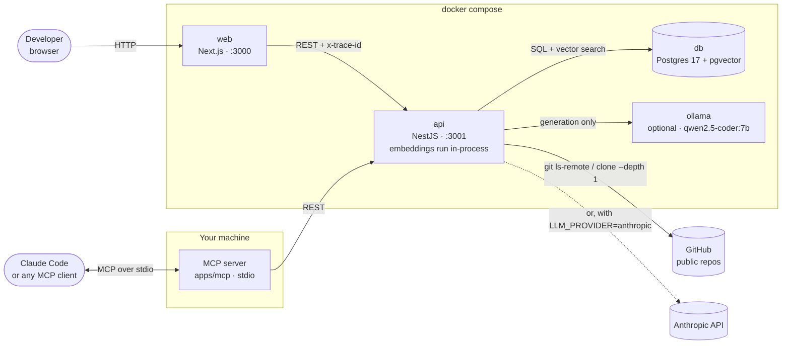
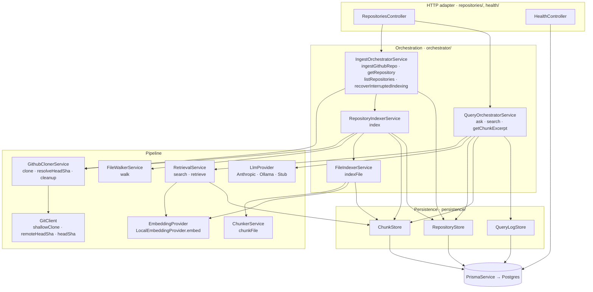
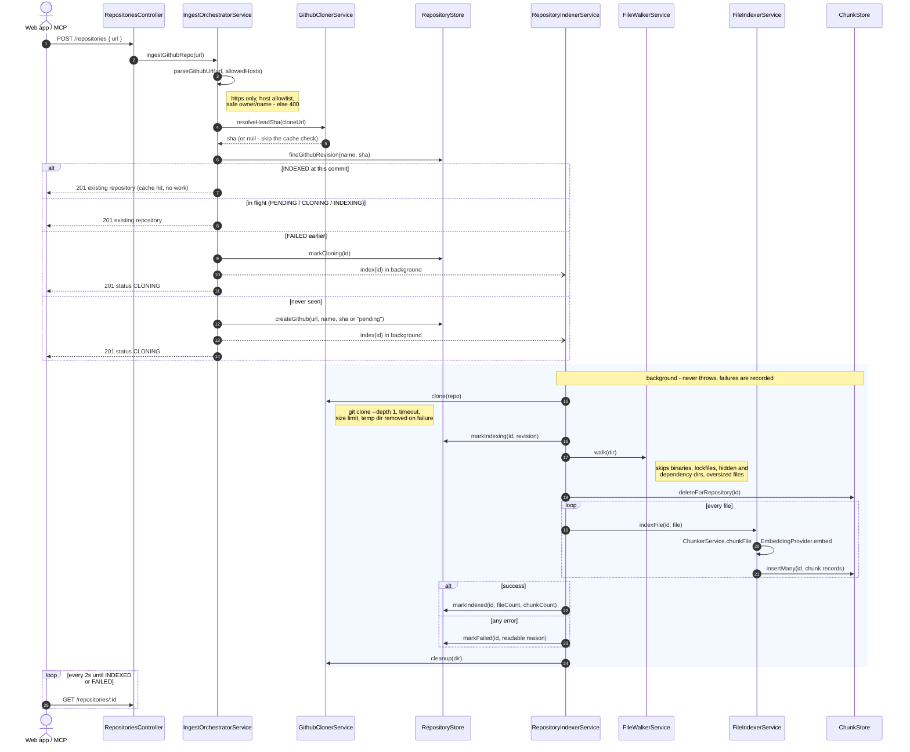
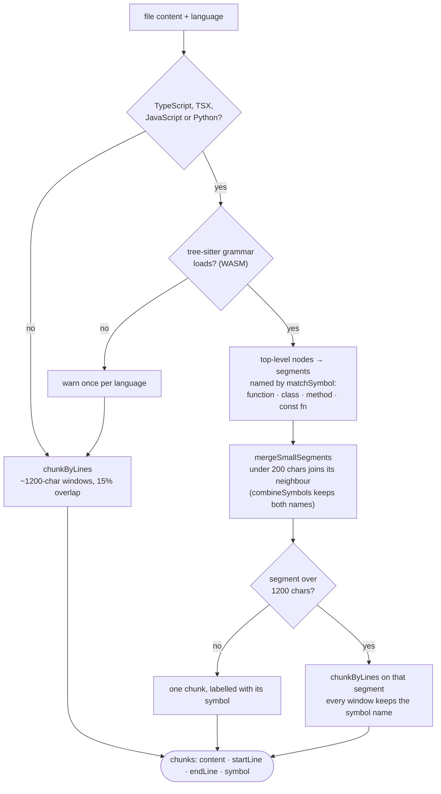
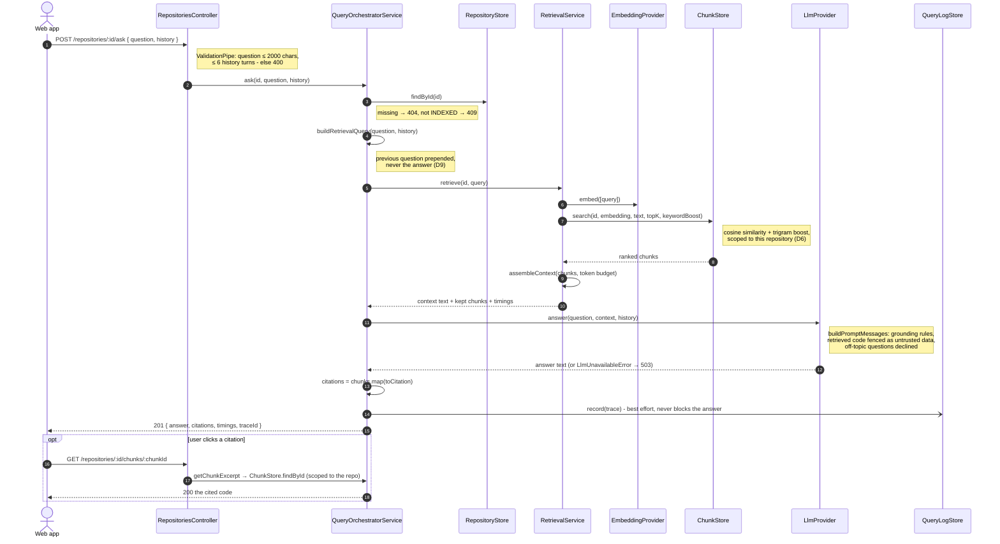
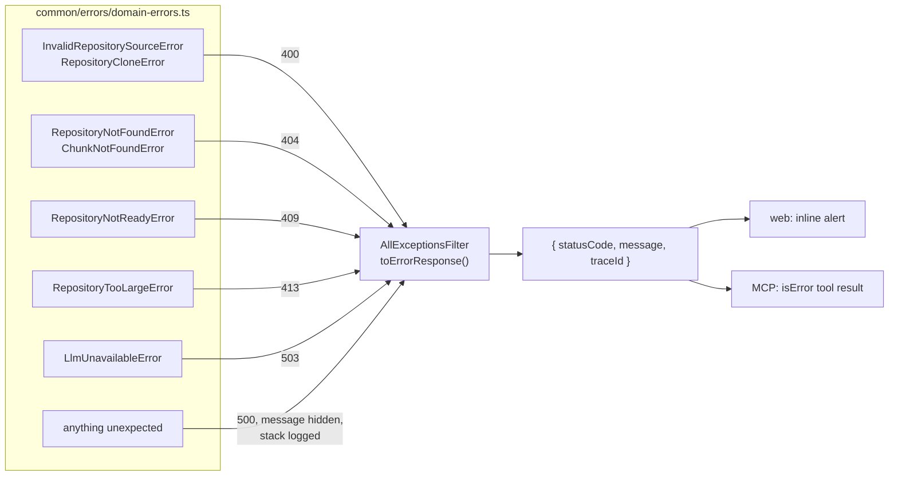
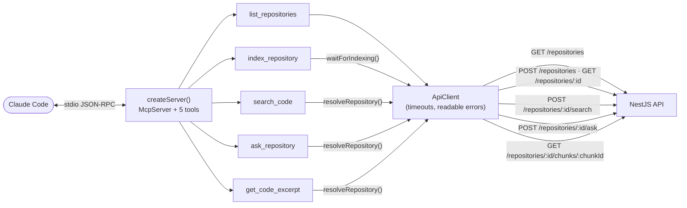
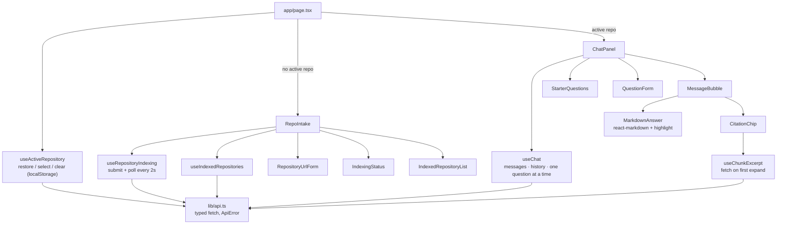
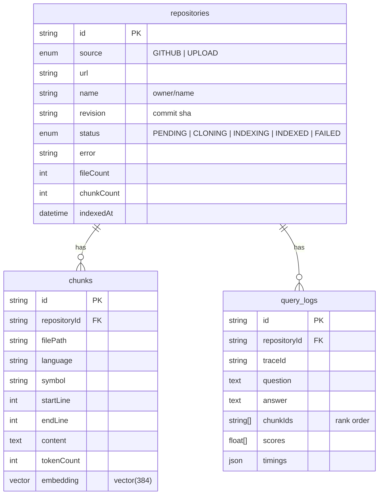

# Code Documentation Assistant

Ingest a codebase, then ask how it works and get answers cited back to the
exact file and line range.

> **Status: Phase 1 (core RAG), not yet verified end to end.** Ingest, chunking,
> local embeddings, retrieval, the Anthropic/Ollama providers and a working
> chat UI are all wired together. What's still missing before this is
> "done": the upload path, the MCP server, and a real test/verification pass
> against a live repository.

---

## Quick start

You need Docker and Node 22. Pick one command depending on which LLM you
want to answer questions - both are genuinely one command, no manual `.env`
editing required:

```bash
npm install   # once, to produce the lockfile the Docker build expects

npm run setup -- anthropic   # hosted Claude - prompts for an API key
# or
npm run setup -- ollama      # fully local - no API key, nothing else to install
```

Either way, `setup` creates `.env` from `.env.example`, configures the chosen
provider, and runs `docker compose up --build` for you.

- Web UI: http://localhost:3000
- API: http://localhost:3001/health

Embeddings run locally inside the API container either way, so that part
never needs a credential or has an ongoing cost.

**`anthropic`** prompts once for `ANTHROPIC_API_KEY` (from
https://console.anthropic.com/) if `.env` doesn't already have one, then
brings the stack up. Nothing else to configure.

**`ollama`** brings up a bundled Ollama container alongside the rest of the
stack and pulls `qwen2.5-coder:7b` into it automatically - fully local, no
API key. Two things to know: the first run downloads that model (~4.7GB) on
top of the usual image builds, so it takes noticeably longer than the
anthropic path (`docker compose logs -f ollama-pull` shows progress); and
because Docker Desktop's Linux VM has no GPU/Metal access, inference runs
CPU-only and is slower per answer than a native Ollama install
(`brew install ollama`) would be.

Already set up and want to swap providers without a full rebuild:

```bash
npm run llm:switch -- ollama
npm run llm:switch -- anthropic
```

This only recreates the `api` container (and starts `ollama`/pulls the model
the first time you switch to it) - much faster than re-running `setup`.

### Local development loop

Docker rebuilds are slow to iterate against. For development, run only
Postgres in a container:

```bash
docker compose up -d db
npm install
npm run db:generate
npm run db:migrate
npm run dev          # api on :3001, web on :3000
```

Requires Node 22 and npm 10+ (ships with it). Local-only commands
(`dev`, `test`, `db:migrate`, `db:studio`) load `.env` from the repository root via
`dotenv-cli`, since npm runs workspace scripts with the workspace folder as
the working directory. `docker compose` and CI never need this - they get
real environment variables injected directly.

`npm install` also wires up a Husky pre-commit hook (via the `prepare`
script) that runs Prettier and each workspace's ESLint on staged files -
CI enforces the same two checks (`format:check`, `lint`) independently, so
a bypassed or missing hook still gets caught.

### Useful commands

| Command                                   | What it does                                                                           |
| ----------------------------------------- | -------------------------------------------------------------------------------------- |
| `npm run setup -- ollama\|anthropic`      | One-command Docker setup with the chosen LLM provider (see Quick start)                |
| `npm run llm:switch -- ollama\|anthropic` | Swaps provider on an already-running stack without a full rebuild                      |
| `npm run mcp:build`                       | Builds the MCP server for Claude Code (see Using it from Claude Code)                  |
| `npm run dev`                             | Runs API and web in watch mode                                                         |
| `npm test`                                | Unit and integration tests                                                             |
| `npm run lint` / `npm run typecheck`      | Static checks, same ones CI runs                                                       |
| `npm run format` / `npm run format:check` | Prettier - write or verify; the pre-commit hook runs the write version on staged files |
| `npm run db:migrate`                      | Creates/applies a migration against the dev database                                   |
| `npm run db:studio`                       | Prisma Studio, for poking at indexed chunks                                            |

---

## Architecture

Everything a client can do goes through one HTTP API. The web app and the MCP
server are both clients of it, so an answer in the browser and an answer
given to Claude Code go through exactly the same retrieval, prompt and
guardrails. Diagrams below are Mermaid, so they render on GitHub and stay in
version control next to the code they describe.

### System context

What runs where, and who talks to whom.



The only calls that leave the machine are the git clone and, if you chose
Anthropic, the answer generation. Embeddings never do: `bge-small-en-v1.5`
runs inside the API process (D3).

### Layers inside the API

Dependencies point one way - top to bottom. Nothing depends on a controller,
orchestrators never touch Prisma directly, and every database query lives in
one of three stores. That is what lets each box be unit-tested with fakes
for the boxes below it.



Cross-cutting pieces sit beside the layers rather than in them: `AppConfig`
(validated env, built once), `AppLogger` (pino, trace id mixed into every
line), `trace.middleware` (AsyncLocalStorage trace scope per request),
`AllExceptionsFilter` (one error shape), and `configureApp()`, which applies
all of that identically in `main.ts` and in the tests.

### Indexing a repository

`POST /repositories` returns in milliseconds; the actual work runs in the
background (D8) and the client polls for status.



### How a file becomes chunks



### Answering a question



### Errors

Services throw domain errors that know nothing about HTTP; one filter maps
them to status codes. Each client shows the same message: the web app shows
it inline, the MCP server returns it to the model as a tool error.



### MCP server

`apps/mcp` is a small stdio server that turns the API into tools. It holds no
business logic - each tool resolves the repository, makes one or two API
calls, and formats the result as text for the model (D14).



`search_code` is the tool meant for Claude: it returns ranked chunks with
their full source instead of another model's summary, because the model
calling it is usually the stronger reasoner.

### Web app

Components only render; state and API calls live in hooks.



### Data model



`(source, name, revision)` is unique, so the same commit is never indexed
twice. `query_logs` is the retrieval trace - the table you actually reach for
when an answer is wrong.

### Backend modules (`apps/api/src`)

| Module            | Responsibility                                                            |
| ----------------- | ------------------------------------------------------------------------- |
| `config/`         | Parses and validates the environment once, at boot                        |
| `common/errors/`  | Transport-agnostic domain errors                                          |
| `common/filters/` | Maps any thrown error to the API's single error shape                     |
| `common/logging/` | pino logger, trace id propagation via AsyncLocalStorage                   |
| `prisma/`         | Database client lifecycle                                                 |
| `persistence/`    | `RepositoryStore`, `ChunkStore`, `QueryLogStore` - every query lives here |
| `health/`         | Liveness and configuration echo                                           |
| `ingest/`         | Git access, cloning with guardrails, file walking and filtering           |
| `chunking/`       | tree-sitter parsing, symbol rules, line-based fallback                    |
| `embedding/`      | Embedding provider interface + local implementation                       |
| `retrieval/`      | Search, retrieval query, context assembly                                 |
| `answering/`      | Prompt construction, LLM providers (Anthropic / Ollama / stub) + factory  |
| `orchestrator/`   | Ingest, indexing and query use cases - what every endpoint calls          |
| `repositories/`   | HTTP controller and request DTOs                                          |

### Repository layout

```
apps/api         NestJS backend (REST API, indexing pipeline, RAG)
apps/web         Next.js frontend
apps/mcp         MCP server for Claude Code and other MCP clients
packages/shared  TypeScript contract shared by all three
scripts/         One-command setup and provider switching
docs/            Decision log
.mcp.json        Registers the MCP server for Claude Code in this folder
```

---

## Using it from Claude Code (MCP)

With the stack running (`npm run setup -- ollama` or `-- anthropic`) and the
server built (`setup` does this, or run `npm run mcp:build`):

**Option 1 - project config (zero setup).** Open Claude Code in this folder.
It reads `.mcp.json`, asks you to approve the `repo-scrapper` server once, and
the tools are available. Check with `/mcp`.

**Option 2 - register it for every project.**

```bash
claude mcp add --scope user repo-scrapper -- node "$(pwd)/apps/mcp/dist/index.js"
claude mcp list        # should show repo-scrapper ... ✓ Connected
```

Then ask Claude Code things like:

- "Index https://github.com/expressjs/express with repo-scrapper."
- "Use repo-scrapper to find where express parses query strings, then explain it."
- "What repositories does repo-scrapper have indexed?"

| Tool                | What it does                                                            |
| ------------------- | ----------------------------------------------------------------------- |
| `list_repositories` | Every known repository with id, status and counts                       |
| `index_repository`  | Index a public GitHub URL; waits for completion unless `wait: false`    |
| `search_code`       | Semantic + keyword search, returns ranked chunks with their full source |
| `ask_repository`    | A grounded answer from the assistant's own LLM, with sources            |
| `get_code_excerpt`  | The full code of one chunk by id                                        |

Repositories can be referred to by id or by `owner/name`. Configuration, all
optional: `REPO_SCRAPPER_API_URL` (default `http://localhost:3001`),
`REPO_SCRAPPER_REQUEST_TIMEOUT_MS`, `REPO_SCRAPPER_INDEX_TIMEOUT_MS`,
`REPO_SCRAPPER_POLL_INTERVAL_MS`. If the API isn't running, every tool says
so and tells you how to start it.

---

## Testing

| Command                         | Scope                                                                |
| ------------------------------- | -------------------------------------------------------------------- |
| `npm test`                      | Everything below, all workspaces (what CI runs, with Postgres)       |
| `npm run test:unit -w @app/api` | API unit + HTTP contract tests - no database needed                  |
| `npm run test:e2e -w @app/api`  | Full ingest → ask through a real DB, plus the golden retrieval set   |
| `npm run test:cov -w @app/api`  | API unit tests with a coverage report                                |
| `npm test -w @app/web`          | Web hooks and components (Vitest + Testing Library, jsdom)           |
| `npm test -w @app/mcp`          | MCP tools, protocol (in-memory) and the built binary over real stdio |

What the layers catch:

- **Unit tests** cover every service, store, mapper, provider and hook with
  fakes for their dependencies - happy paths, failure paths (git failing,
  the LLM down, a store rejecting) and edges (empty repositories, limits at
  exactly their boundary, one-line windows that used to loop forever).
- **HTTP contract tests** boot the real Nest pipeline (validation, error
  filter, trace middleware) with faked orchestrators and pin down every
  status code and error body without a database.
- **E2E and golden-set tests** run the real pipeline against Postgres and the
  local embedding model; the golden set asserts recall@2 so a chunking or
  retrieval change that quietly makes search worse fails the build (D11).
- **MCP tests** go through the real protocol twice: in memory against the
  server, and by spawning `node apps/mcp/dist/index.js` over stdio exactly
  as Claude Code does.

---

## Trying it out

1. `npm install`
2. `npm run setup -- ollama` (or `-- anthropic`)
3. Open http://localhost:3000, paste a small public repo URL (for example
   `https://github.com/expressjs/express`), wait for "Ready", and ask
   something - or click one of the starter questions.
4. Click any citation under an answer to see the exact code it came from.

## Sections still to write

Required by the assignment brief ("What to Submit", item 2), to be written in
my own words. Progress is tracked in [`plan.md`](plan.md).

- [ ] Productionising this and deploying it on a hyperscaler (2c)
- [ ] RAG/LLM approach and decisions (2d)
- [ ] Key technical decisions (2e)
- [ ] Engineering standards followed, and the ones I skipped (2f)
- [ ] How I used AI tools while building this (2g)
- [ ] What I would do differently with more time (2h)
- [ ] Known limitations and edge cases
- [ ] Screenshots

Decisions made so far, with reasoning, are logged in
[`docs/decisions.md`](docs/decisions.md).
