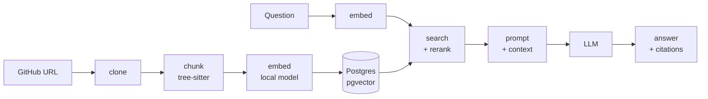

# Code Documentation Assistant

Give it a link to a public GitHub repository. It reads the code, and then you
can ask questions about that code in plain English. Every answer shows the
files and line ranges it used, and you can click any source to see the real
code behind it.

Built for the Fullstack AI Engineer assignment (Option 2).

## What it does

- **Indexes a public GitHub repo.** Clones it, splits the code on real function
  and class boundaries, embeds each piece.
- **Answers questions about it.** "Where does login happen?", "What does this
  service depend on?", "How do I add an endpoint?"
- **Shows its sources.** Every answer carries the file paths and line ranges it
  was built from. Click one to see that code.
- **Follows a conversation.** "And where is that called from?" resolves against
  the previous turn.
- **Runs with no API key.** Embeddings always run locally. For the answer you
  pick Claude or `qwen2.5-coder:7b` via Ollama; with Ollama nothing leaves your
  machine except the `git clone`.
- **Works from your editor.** The same API is exposed as MCP tools, so Claude
  Code can index and search a repo while you work.

## Quick start

```bash
npm install                  # once, so Docker can use the lockfile

npm run setup -- anthropic   # uses Claude. Asks for an API key once.
# or
npm run setup -- ollama      # fully local. No API key, nothing else to install.
```

Then open [localhost:3000](http://localhost:3000). The API's health check is at
[localhost:3001/health](http://localhost:3001/health).

Both commands write `.env` from `.env.example`, set the provider, and run
`docker compose up --build`. There is no file to edit by hand.

The `ollama` option starts an Ollama container and pulls `qwen2.5-coder:7b`
into it. The first run downloads about 4.7GB — `docker compose logs -f ollama-pull`
shows progress — and Docker Desktop cannot pass a GPU through, so answers are
slower than a native Ollama install.

To switch provider later without a rebuild: `npm run llm:switch -- ollama` (or
`anthropic`).

**You need** Docker Desktop running, and Node 22 with npm 10+ (`nvm use` picks
it up from `.nvmrc`).

### Working on the code

Docker rebuilds are slow while editing. Run only the database in Docker:

```bash
docker compose up -d db
npm install && npm run db:generate && npm run db:migrate
npm run dev          # api on :3001, web on :3000
```

`npm install` also installs a pre-commit hook running Prettier and ESLint on
staged files. CI runs the same checks, so a skipped hook still gets caught.

| Command                                   | What it does                                   |
| ----------------------------------------- | ---------------------------------------------- |
| `npm run dev`                             | API and web in watch mode                      |
| `npm test`                                | Every test in every workspace (needs Postgres) |
| `npm run lint`, `npm run typecheck`       | The static checks CI runs                      |
| `npm run format`, `npm run format:check`  | Prettier write or check                        |
| `npm run db:migrate`, `npm run db:studio` | Migrate; browse indexed chunks                 |
| `npm run mcp:build`                       | Build the MCP server                           |
| `npm run docker:clean`                    | Free disk: dangling images and old build cache |

---

## How it works



Three things happen when a repository is indexed — clone, chunk, embed — and
two when a question arrives: retrieve, then generate. The API is a NestJS app
where each of those stages is its own module, and orchestrators wire them
together. Nothing below an orchestrator knows about HTTP.

### Where things live

| Step                                | Code                                                                                                                                         |
| ----------------------------------- | -------------------------------------------------------------------------------------------------------------------------------------------- |
| Validate and parse the URL          | [`parse-github-url.ts`](apps/api/src/ingest/parse-github-url.ts)                                                                             |
| Shallow clone, size guardrails      | [`github-cloner.service.ts`](apps/api/src/ingest/github-cloner.service.ts)                                                                   |
| Walk files, skip binaries/lockfiles | [`file-walker.service.ts`](apps/api/src/ingest/file-walker.service.ts)                                                                       |
| Split into chunks                   | [`tree-sitter-chunker.ts`](apps/api/src/chunking/tree-sitter-chunker.ts)                                                                     |
| Embed chunks                        | [`local-embedding.provider.ts`](apps/api/src/embedding/local-embedding.provider.ts)                                                          |
| Store and search chunks             | [`chunk.store.ts`](apps/api/src/persistence/chunk.store.ts)                                                                                  |
| Rank and trim to a token budget     | [`retrieval.service.ts`](apps/api/src/retrieval/retrieval.service.ts), [`context-assembler.ts`](apps/api/src/retrieval/context-assembler.ts) |
| Build the prompt                    | [`prompt.ts`](apps/api/src/answering/prompt.ts)                                                                                              |
| Call the model                      | [`anthropic.provider.ts`](apps/api/src/answering/anthropic.provider.ts), [`ollama.provider.ts`](apps/api/src/answering/ollama.provider.ts)   |
| Drive indexing end to end           | [`ingest-orchestrator.service.ts`](apps/api/src/orchestrator/ingest-orchestrator.service.ts)                                                 |
| Drive a question end to end         | [`query-orchestrator.service.ts`](apps/api/src/orchestrator/query-orchestrator.service.ts)                                                   |
| HTTP surface (6 endpoints)          | [`repositories.controller.ts`](apps/api/src/repositories/repositories.controller.ts)                                                         |

Indexing returns immediately and continues in the background; the UI polls the
repository's status. Answers are synchronous.

---

## The RAG approach

**Chunking.** Splitting code every N lines cuts functions in half, and half a
function retrieves badly and reads worse in an answer. tree-sitter parses the
file and splits on real function and class boundaries, so a chunk is a thing
with a name — which also gives every citation a symbol to display. TypeScript,
JavaScript and Python are parsed; everything else falls back to a line-window
split with overlap. A function too big for one chunk is windowed rather than
dropped.

**Embeddings.** `bge-small-en-v1.5` runs in the API container, 384 dimensions.
Anthropic has no embedding endpoint, so a hosted embedding model would have
meant a second vendor and a second key for a reviewer to obtain. Local costs
nothing, works offline, and keeps the code on the machine. The model is small
enough that indexing a mid-sized repo takes seconds, not minutes.

**Storage.** One Postgres with pgvector holds both the rows and the vectors, so
"chunks of this repository" is a foreign key rather than a sync problem between
two systems. A dedicated vector database earns its place at a scale this is not
at, and would have added an operational component for no gain here.

**Retrieval.** The question is embedded and matched by cosine similarity, with
a small trigram keyword score blended in — questions about code quote
identifiers verbatim, and embeddings are mediocre at exact-token matching. How
that query is shaped turned out to matter more than the blend; see below.

**Generation.** The top chunks are packed into a token budget, each headed by
its file path and line range, and handed to the model with instructions to
answer only from them and to say so when the answer is not there. The file
content is fenced in `<context>` and the replayed conversation history in
`<history>`, both labelled untrusted, because indexed code and client-supplied
history are both attacker-reachable and neither should be able to issue
instructions.

### The retrieval query, and the index

This is the part I got wrong first, so it is worth writing down.

The obvious way to write hybrid search is to blend both scores in one
`ORDER BY`:

```sql
ORDER BY (1 - (embedding <=> $vec)) + ($boost * similarity(content, $text)) DESC
```

That is correct, and it never uses the vector index. pgvector's HNSW index can
only accelerate an ordering that is _purely_ the distance operator; add
anything to the expression and Postgres silently falls back to scanning every
row. The trigram GIN index had the same problem in reverse — `similarity()` in
a `SELECT` expression cannot use it, only the `%` operator in a `WHERE` can, so
it was written on every insert and read by nothing.

Search now runs in two stages: find nearest neighbours by distance alone, then
rerank that candidate pool with the keyword boost
([`chunk.store.ts`](apps/api/src/persistence/chunk.store.ts)).

Measured on 20k chunks, same data, same results:

|                    | Plan                                         | Rows examined | Time    |
| ------------------ | -------------------------------------------- | ------------- | ------- |
| Blended `ORDER BY` | `Seq Scan`                                   | 20,003        | 66.5 ms |
| Two-stage          | `Index Scan using chunks_embedding_hnsw_idx` | 39            | 0.8 ms  |

One more thing that is easy to miss: `hnsw.ef_search` caps how many candidates
the index walk returns and defaults to 40, so asking for `LIMIT 80` quietly
returns 39. The pool size is set explicitly per query, inside the transaction,
so it cannot leak onto a pooled connection.

The kept index is the HNSW one. The trigram index is deliberately absent — the
rerank runs over at most a few hundred rows, where a sequential `similarity()`
is free. `pg_trgm` itself is still required, because `similarity()` is its
function.

### Why there is no LangChain

The orchestration here is about 150 lines: retrieve, assemble, prompt, call,
log. A framework would have replaced that with configuration plus a dependency
whose abstractions I would still have had to read to debug a bad answer. The
place I want to be able to reason about precisely — what exactly went into the
prompt — is the place a framework hides. At this size the framework is the
bigger thing to understand.

### Observability

Someone says an answer is wrong. "The model made it up" and "search handed it
the wrong files" need different fixes and look identical from outside.

Every request gets a trace id, carried through `AsyncLocalStorage`, put on every
log line and returned in the response body. Every answered question is also
written to `query_logs` with the retrieved chunk ids in rank order, their
scores, and per-stage timings. When an answer is wrong you look up the trace and
see exactly what the model was handed.

---

## Retrieval quality

Retrieval is the part of a RAG system that degrades silently: nothing crashes,
no unit test goes red, the answers just start citing the wrong file. So there
is a golden set — a small fixture repository indexed through the real pipeline,
with questions whose answer file is known, asserted at recall@3
([`golden-retrieval.e2e-spec.ts`](apps/api/test/golden-retrieval.e2e-spec.ts)).

Two deliberate near-miss pairs live in that fixture, because a question set
where every answer is lexically obvious measures nothing:

- `auth.ts` (verifying a person's password) against `webhook-verify.ts`
  (verifying a machine's HMAC signature)
- `http-client.ts` (retrying a network request) against `job-queue.py`
  (retrying a background job)

`KEYWORD_BOOST` was chosen by hand, so there is also a test that measures
recall with the boost at `0` and at its configured value and fails if the boost
ever ranks worse than not having it. The weight is a config value backed by a
number, not by an argument - and the measurement found a real limit: no weight
up to 1.2 could rescue an obliquely-phrased question the embedding model
ranked badly, because at a weight small enough to be safe for ordinary
queries, the trigram boost simply cannot add enough score to close a large
embedding-distance gap. See D6 in `docs/decisions.md` for the numbers. A
reranker is the fix; not built.

What this does **not** measure is whether the answers themselves are good. That
needs an eval harness with a model grading output, which was out of scope for
the time available. It is the first gap I would close.

---

## Key technical decisions

Full reasoning for each, written at the time, is in
[`docs/decisions.md`](docs/decisions.md). An earlier, longer draft of this
README with per-flow file walkthroughs is kept at
[`docs/readme-in-depth.md`](docs/readme-in-depth.md), corrected where it
disagreed with the current code. The short version of the decisions:

| #   | Decision                                                      | What it costs                                   |
| --- | ------------------------------------------------------------- | ----------------------------------------------- |
| D1  | Monorepo: three apps and one shared types package             | Slightly more build wiring                      |
| D2  | Postgres + pgvector as the only database                      | Manual index tuning at scale                    |
| D3  | The embedding model runs locally, not in the cloud            | Model weights in the image                      |
| D4  | The vector size is fixed in the schema, on purpose            | Changing model means a migration                |
| D5  | Chunk on real code borders, with a fallback that always works | A WASM grammar per language                     |
| D6  | Nearest-neighbour search first, then a keyword rerank         | Candidate pool size is a tuning knob            |
| D7  | Cheap by default                                              | Fewer chunks than a generous budget would allow |
| D8  | No job queue in v1                                            | Lost on restart; bounded concurrency instead    |
| D9  | Conversation history comes from the client                    | Server stateless; history is untrusted input    |
| D10 | The MCP server talks over stdio                               | One client shape, not a hosted endpoint         |
| D11 | Three layers of tests, none calling a live API                | Fixtures need maintaining                       |
| D12 | npm workspaces, not pnpm                                      | Slower installs                                 |
| D13 | Skipped the extra tooling installs                            | Some conveniences left on the table             |
| D14 | The MCP server is its own process calling the HTTP API        | A second client surface to test                 |
| D15 | Services throw domain errors, not HTTP errors                 | One more mapping layer                          |
| D16 | Test at the seams that actually break                         | Coverage is uneven by design                    |

The four worth reading in full are D6 (retrieval), D8 (no queue), D9 (stateless
history) and D14 (why the MCP server returns code rather than prose).

---

## Testing

| Command                         | Scope                                                              |
| ------------------------------- | ------------------------------------------------------------------ |
| `npm test`                      | Everything, all workspaces. What CI runs. Needs Postgres           |
| `npm run test:unit -w @app/api` | API unit and HTTP contract tests. No database                      |
| `npm run test:e2e -w @app/api`  | Real ingest and ask against a real DB, plus the golden set         |
| `npm test -w @app/web`          | Web hooks and components (Vitest + Testing Library)                |
| `npm test -w @app/mcp`          | MCP tools, the protocol in memory, and the built binary over stdio |

Four layers, each for a different kind of bug. **Unit tests** cover every
service, store, mapper, provider and hook with fakes — happy paths, failure
paths, and edge cases like a one-line window that used to loop forever.
**HTTP contract tests** boot the real Nest pipeline with fake orchestrators and
pin every status code and error body without a database. **E2E and golden set**
run the real pipeline against Postgres and the real embedding model. **MCP
tests** go through the real protocol twice, including by spawning the built
binary over stdio the way Claude Code does.

There is slightly more test code than application code. Tests never call a
hosted LLM: the provider is stubbed and embeddings are local, so CI needs no
credentials.

---

## Using it from Claude Code (MCP)

Start the stack first (`npm run setup` also builds the server), then either
open Claude Code in this folder — it reads `.mcp.json` and asks you to approve
the `repo-scrapper` server once — or register it globally:

```bash
claude mcp add --scope user repo-scrapper -- node "$(pwd)/apps/mcp/dist/index.js"
claude mcp list        # repo-scrapper ... ✓ Connected
```

| Tool                | What it does                                                 |
| ------------------- | ------------------------------------------------------------ |
| `list_repositories` | Every known repository with id, status and counts            |
| `index_repository`  | Index a public GitHub URL. Waits for it unless `wait: false` |
| `search_code`       | Ranked chunks with their full source                         |
| `ask_repository`    | A written answer from this app's own LLM, with sources       |
| `get_code_excerpt`  | The full code of one chunk by id                             |

`search_code` is the one meant for Claude: it returns ranked code rather than a
summary written by another model, because the model calling it is usually the
better reasoner. Repositories can be named by id or by `owner/name`. Every
setting is optional (`REPO_SCRAPPER_API_URL` and three timeouts); if the API is
not running, each tool says so and how to start it.

---

## What I skipped, and why

| Skipped                               | Why                                                             | Would it matter in production  |
| ------------------------------------- | --------------------------------------------------------------- | ------------------------------ |
| Authentication and users              | Single-user demo                                                | Yes, first thing needed        |
| Rate limiting                         | No public surface yet                                           | Yes, indexing is easy to abuse |
| Job queue for indexing                | A queue earns its place with retries and workers (D8)           | Yes                            |
| Answer-quality evals                  | Needs a model in the loop; retrieval is tested, answers are not | Yes                            |
| Browser E2E (Playwright)              | Component tests cover the logic, the UI is one page             | Medium                         |
| OpenAPI spec                          | Six endpoints, typed both sides through `packages/shared`       | Medium                         |
| Metrics and traces (Prometheus, OTel) | Logs plus `query_logs` were enough at this size                 | Yes                            |
| A real tokenizer for the budget       | A 3-chars-per-token estimate that errs high                     | Low                            |
| Private repos, non-GitHub hosts       | The allowlist is one env var                                    | Depends                        |
| Streaming answers                     | Real complexity in API and client for a UX win                  | Nice to have                   |

## Known limits

- **Two people indexing the same repository at the same moment** can each
  create a row, because the check and the insert are not atomic. The unique
  constraint keeps the data sane; one request just loses.
- **Indexing lives in the API process.** `MAX_CONCURRENT_INDEXING` (default 2)
  caps how many run at once and the rest queue, but the queue is in memory: a
  restart marks anything unfinished as FAILED, which is retryable but not
  automatic.
- **English questions only.** The embedding model is English.
- **TypeScript, JavaScript and Python** get real parsing. Other languages get
  the line-window fallback, which is worse but not broken.
- **No re-indexing on a new commit.** A repository is pinned to the revision it
  was indexed at; a newer commit is a new row.
- **The citation list is what retrieval supplied**, not a verified per-sentence
  attribution of the answer.

## Taking this to production

In the order I would actually do it: move indexing to a real queue with workers
and retries; add authentication and per-user repository scoping; add rate
limiting on the indexing endpoint; bake the embedding model into the image
rather than downloading on first run; add answer-quality evals; add metrics and
traces alongside the logs; tune HNSW build parameters (`m`, `ef_construction`)
for the real corpus size once there is one; and cap spend per user once the
provider is a hosted model.

---

## How I used AI tools

I used Cursor for editor-level work and Claude for the bigger pieces —
scaffolding modules, first drafts of tests, and talking through design choices
before committing to them.

**What worked.** Generating the boring, high-volume code: DTOs, mappers, test
fixtures, the repetitive parts of the provider implementations. Getting a first
version of a module quickly and then rewriting the half I disagreed with.
Rubber-ducking a decision — arguing with a model about whether to use a job
queue sharpened the reasoning that ended up in D8, and the conclusion was "no",
which is not what it suggested first.

**What did not work.** It is confidently wrong about things that look right.
Three examples from this repo, all caught by checking rather than by reading:

- The hybrid search query blended both scores into one `ORDER BY`. That is the
  natural way to write it, it passed tests, and it silently disabled the vector
  index. `EXPLAIN` is what found it.
- A comment I nearly shipped claimed pgvector derives `ef_search` from the
  query's `LIMIT`. It does not. Measuring showed 39 rows coming back for
  `LIMIT 80`.
- A generated plan referenced two plugin skills by name that do not exist.

The pattern is that generated code fails in the places where nothing goes red:
plans, index usage, prompt/code drift. So the rule I settled on is that
anything a model asserts about behaviour gets verified against the thing
itself — `EXPLAIN` for a query plan, a test for a claim about ranking, a run
for a claim about output — before it goes in a comment, let alone in this file.

**Repeatability.** Everything here is reproducible from the repo: the golden
set measures retrieval, the plans above are in `docs/decisions.md` with the
reasoning as it was at the time, and CI runs the same checks a reviewer would.

---

## Configuration

`npm run setup` writes `.env`. This is only needed to change something by hand;
every variable has a working default except the Anthropic key. `.env.example`
has the full list with comments.

| Variable                  | Default                    | What it does                                   |
| ------------------------- | -------------------------- | ---------------------------------------------- |
| `LLM_PROVIDER`            | `anthropic`                | `anthropic`, `ollama` or `stub`                |
| `ANTHROPIC_API_KEY`       | empty                      | Needed only for the anthropic provider         |
| `ANTHROPIC_MODEL`         | `claude-haiku-4-5`         | Swap to Sonnet for better synthesis            |
| `ANTHROPIC_MAX_TOKENS`    | `1024`                     | Max length of an answer                        |
| `OLLAMA_BASE_URL`         | `http://localhost:11434`   | `http://ollama:11434` inside compose           |
| `OLLAMA_MODEL`            | `qwen2.5-coder:7b`         | Any model you have pulled                      |
| `EMBEDDING_MODEL`         | `Xenova/bge-small-en-v1.5` | Changing this needs a migration and a re-index |
| `EMBEDDING_DIMENSIONS`    | `384`                      | Must match the model and the schema            |
| `RETRIEVAL_TOP_K`         | `8`                        | How many chunks to retrieve                    |
| `CONTEXT_TOKEN_BUDGET`    | `4000`                     | How much of them fits in the prompt            |
| `KEYWORD_BOOST`           | `0.15`                     | Weight of the keyword rerank. `0` disables it  |
| `MAX_REPO_SIZE_MB`        | `200`                      | Clone size limit, enforced during the clone    |
| `MAX_FILES`               | `5000`                     | Files indexed per repository                   |
| `MAX_FILE_SIZE_KB`        | `512`                      | Skip files bigger than this                    |
| `CLONE_TIMEOUT_MS`        | `120000`                   | Give up on a slow clone                        |
| `MAX_CONCURRENT_INDEXING` | `2`                        | Repositories indexed at once; the rest queue   |
| `ALLOWED_REPO_HOSTS`      | `github.com`               | Comma-separated allowlist                      |
| `LOG_LEVEL`               | `info`                     | pino level                                     |
| `NEXT_PUBLIC_API_URL`     | `http://localhost:3001`    | API origin the browser uses                    |

## License

MIT. See [LICENSE](LICENSE).
