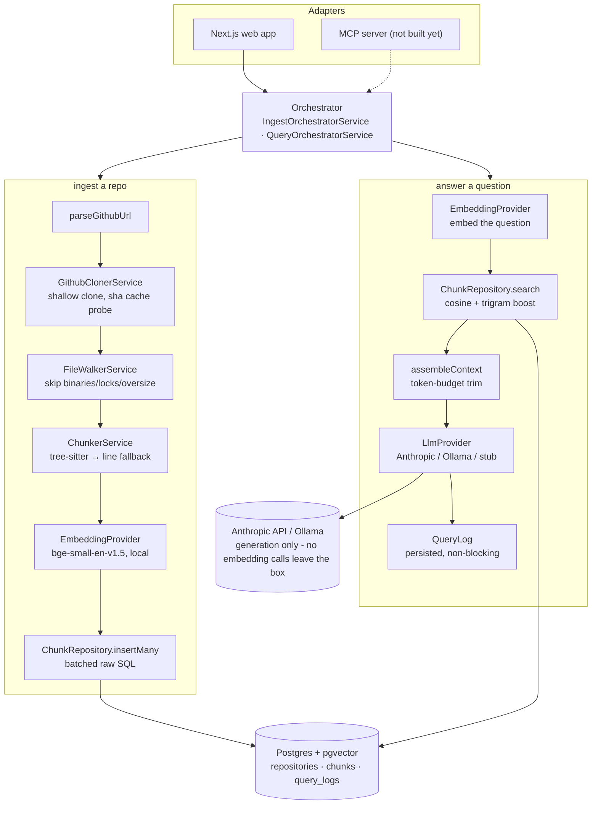

# Code Documentation Assistant

Ingest a codebase, then ask how it works and get answers cited back to the
exact file and line range.

> **Status: Phase 1 (core RAG), not yet verified end to end.** Ingest, chunking,
> local embeddings, retrieval, the Anthropic/Ollama providers and a working
> chat UI are all wired together. What's still missing before this is
> "done": the upload path, the MCP server, and a real test/verification pass
> against a live repository.

---

## Quick start

You need Docker, Node 22 and one API key.

```bash
# once, to produce the lockfile the Docker build expects
npm install

cp .env.example .env
# open .env and set ANTHROPIC_API_KEY=sk-ant-...
docker compose up --build
```

The first build takes a few minutes: it compiles both apps and the API
downloads the embedding model on first use.

- Web UI: http://localhost:3000
- API: http://localhost:3001/health

That is the whole setup. Embeddings run locally inside the API container, so
there is no second credential to obtain and no embedding cost.

### Running fully local (no API key at all)

Set `LLM_PROVIDER=ollama` in `.env` and point `OLLAMA_BASE_URL` at an Ollama
instance on the host (`http://host.docker.internal:11434` from inside Docker).
Answer quality drops, but nothing leaves the machine.

### Local development loop

Docker rebuilds are slow to iterate against. For development, run only
Postgres in a container:

```bash
docker compose up -d db
npm install
npm run db:generate
npm run db:migrate
npm run dev          # api on :3001, web on :3000
```

Requires Node 22 and npm 10+ (ships with it). Local-only commands
(`dev`, `test`, `db:migrate`, `db:studio`) load `.env` from the repository root via
`dotenv-cli`, since npm runs workspace scripts with the workspace folder as
the working directory. `docker compose` and CI never need this - they get
real environment variables injected directly.

`npm install` also wires up a Husky pre-commit hook (via the `prepare`
script) that runs Prettier and each workspace's ESLint on staged files -
CI enforces the same two checks (`format:check`, `lint`) independently, so
a bypassed or missing hook still gets caught.

### Useful commands

| Command                                   | What it does                                                                           |
| ----------------------------------------- | -------------------------------------------------------------------------------------- |
| `npm run dev`                             | Runs API and web in watch mode                                                         |
| `npm test`                                | Unit and integration tests                                                             |
| `npm run lint` / `npm run typecheck`      | Static checks, same ones CI runs                                                       |
| `npm run format` / `npm run format:check` | Prettier - write or verify; the pre-commit hook runs the write version on staged files |
| `npm run db:migrate`                      | Creates/applies a migration against the dev database                                   |
| `npm run db:studio`                       | Prisma Studio, for poking at indexed chunks                                            |

---

## Architecture

The HTTP controller and the MCP server are **thin adapters over one
orchestrator**. Neither owns business logic, so an answer given through the web
UI and an answer given to an external LLM go through exactly the same
retrieval, prompt and guardrails.



### Backend modules (`apps/api/src`)

| Module            | Responsibility                                                       |
| ----------------- | -------------------------------------------------------------------- |
| `config/`         | Parses and validates the environment once, at boot                   |
| `common/logging/` | pino logger, trace id propagation via AsyncLocalStorage              |
| `prisma/`         | Database client lifecycle                                            |
| `health/`         | Liveness and configuration echo                                      |
| `ingest/`         | GitHub clone with guardrails, file walking, filtering                |
| `chunking/`       | tree-sitter parsing, chunk construction, line-based fallback         |
| `embedding/`      | Embedding provider interface + local implementation                  |
| `retrieval/`      | Vector search, ranking, context assembly                             |
| `answering/`      | Prompt construction, LLM provider (Anthropic/Ollama/stub)            |
| `orchestrator/`   | Ties the above into ingest + ask - the one thing every adapter calls |
| `repositories/`   | HTTP adapter over the orchestrator                                   |
| `mcp/`            | _(Phase 3, not started)_ MCP tools over the same orchestrator        |

### Repository layout

```
apps/api        NestJS backend
apps/web        Next.js frontend
packages/shared TypeScript contract shared by both
docs/           Decision log
```

### Data model

Three tables. `repositories` tracks ingest state and doubles as the cache key
(`source + name + revision` is unique, so the same commit is never indexed
twice). `chunks` holds the text, its location and a `vector(384)` embedding.
`query_logs` is the retrieval trace: question, the chunk ids and scores that
were retrieved, and per-stage timings. That last table is the thing you
actually reach for when an answer is wrong.

---

## Trying it out

1. `npm install`
2. `docker compose up -d db` (or a full `docker compose up --build` once web/api changes settle)
3. `npm run db:migrate`
4. `npm run dev`
5. Open http://localhost:3000, paste a small public repo URL (something like
   `https://github.com/expressjs/express` to start - a huge repo will just
   sit in "Chunking and embedding" for a while, which is expected), wait for
   it to reach "Ready", then ask it something.

Known-unverified right now: nothing in this pipeline has been run against a
live database or a live LLM call yet. The `web-tree-sitter` grammar loading in
particular is the one piece whose behaviour on a real machine hasn't been
confirmed - see `docs/decisions.md` (D5) for what happens if it doesn't
resolve (line-based chunking, not a crash).

## Sections still to write

These are the parts the assignment asks for in my own words. They are
deliberately empty rather than filled with plausible-sounding text - I will
write them from what actually happens during the build.

- [ ] Productionising this on a hyperscaler
- [ ] RAG/LLM approach and decisions
- [ ] Key technical decisions
- [ ] Engineering standards followed, and the ones I skipped
- [ ] How I used AI tools while building this
- [ ] What I would do differently with more time
- [ ] Known limitations and edge cases

Decisions made so far, with reasoning, are logged in
[`docs/decisions.md`](docs/decisions.md).
